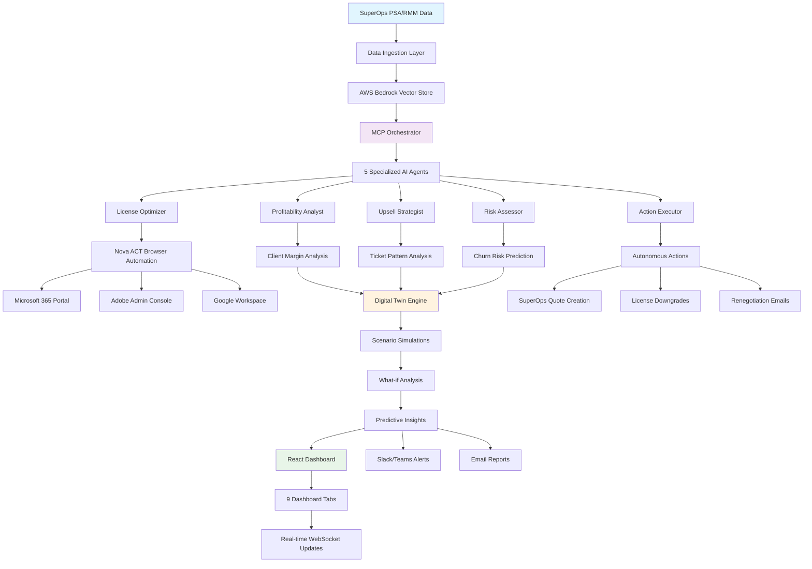

# AI CFO Agent - Process Flow Diagram
**Team Lotus | SuperHack 2025**

## End-to-End Workflow with Digital Twin



## Key Process Steps

### 1. Data Ingestion & Processing
- **Input**: SuperOps PSA/RMM data (contracts, tickets, licenses)
- **Processing**: AWS Bedrock Vector Store for RAG analytics
- **Output**: Structured data ready for AI analysis

### 2. Multi-Agent AI Analysis (MCP Orchestration)
- **Parallel Execution**: 5 specialized agents run simultaneously
- **Coordination**: MCP orchestrator manages workflows
- **Synthesis**: Results combined for comprehensive insights

### 3. Digital Twin Simulation
- **Scenario Modeling**: "What-if" analysis for business decisions
- **Predictive Analytics**: Cashflow risk and churn predictions
- **Impact Assessment**: Revenue/cost implications of changes

### 4. Autonomous Action Execution
- **Safe Actions**: License downgrades, email drafts
- **Human Approval**: Critical actions require confirmation
- **Audit Trail**: Complete logging of all actions

### 5. Multi-Channel Delivery
- **Dashboard**: Real-time React interface with 9 tabs
- **Notifications**: Slack/Teams alerts for urgent issues
- **Reports**: Automated weekly email summaries

## Agent Interaction Flow

```
SuperOps Data → MCP Orchestrator → [5 Agents in Parallel]
                                      ↓
Profitability Agent: Client margin analysis → Risk scoring
License Optimizer: Nova ACT automation → Usage tracking
Upsell Strategist: Ticket analysis → Opportunity identification
Risk Assessor: Churn prediction → Financial risk scoring
Action Executor: Autonomous actions → Email/Quote generation
                                      ↓
Digital Twin Engine: Scenario simulation → Predictive insights
                                      ↓
Multi-Channel Delivery: Dashboard + Alerts + Reports
```

## Real-time Update Cycle

1. **Data Sync** (Every 30 seconds): SuperOps API polling
2. **AI Analysis** (Every 5 minutes): Agent workflow execution
3. **Dashboard Update** (Real-time): WebSocket push notifications
4. **Alert Delivery** (Immediate): Critical issues via Slack/Teams
5. **Report Generation** (Weekly): Automated email summaries

## Nova ACT Browser Automation Flow

```
License Optimizer Agent → Nova ACT Engine → Browser Automation
                                              ↓
Microsoft 365 Admin Center → Usage data extraction
Adobe Admin Console → License utilization tracking
Google Workspace → User activity monitoring
                                              ↓
Usage Analysis → Waste Identification → Autonomous Downgrade
```

## Digital Twin Scenarios

### Scenario 1: Client Churn Impact
- **Input**: "What if TechCorp churns?"
- **Analysis**: Revenue loss, margin impact, replacement cost
- **Output**: "$15K revenue gap, 3-month recovery timeline"

### Scenario 2: Service Expansion
- **Input**: "Add cybersecurity to 3 clients"
- **Analysis**: Implementation cost, revenue potential, resource needs
- **Output**: "$72K annual revenue, 6-month ROI"

### Scenario 3: Price Optimization
- **Input**: "Increase margins by 5%"
- **Analysis**: Client sensitivity, competitive impact, churn risk
- **Output**: "Safe increase for 2/3 clients, $24K additional revenue"

---

**Status**: ✅ **PRODUCTION READY**  
**Real-time Processing**: ✅ **30-second update cycle**  
**Multi-Agent Coordination**: ✅ **5 specialized agents**  
**Digital Twin Simulations**: ✅ **Predictive scenario modeling**